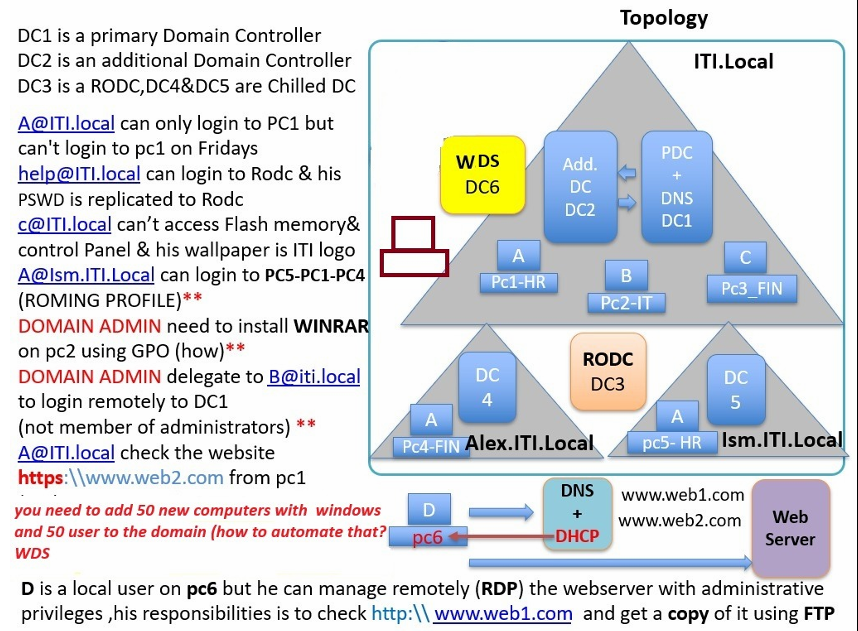

# Windows Server Enterprise Infrastructure — MCSA

## Project Overview

This project demonstrates the design and implementation of a complete enterprise-grade Windows Server infrastructure, simulating a real-world corporate environment built on Microsoft core technologies.

The environment covers the full lifecycle of an Active Directory domain — from initial architecture and DNS/DHCP configuration, through Group Policy enforcement, remote OS deployment, and infrastructure automation using PowerShell.

> **My Role:** As a co-implementor on this project, I participated in the design and hands-on configuration of the domain architecture, infrastructure services, Group Policy, and automation components documented below.

**Full Documentation:**
For detailed step-by-step implementation: 👉 [View Full Project Documentation (PDF)](./MCSA-Project-Documentation.pdf)

---

## Architecture Diagram




---

## Table of Contents

1. [Technology Stack](#technology-stack)
2. [Domain Architecture](#1-domain-architecture)
3. [Infrastructure Services](#2-infrastructure-services)
4. [Security & Group Policy (GPO)](#3-security--group-policy-gpo)
5. [Advanced Configurations](#4-advanced-configurations)
6. [User & Environment Management](#5-user--environment-management)
7. [Windows Deployment Services (WDS)](#6-windows-deployment-services-wds)
8. [Key Takeaways](#key-takeaways)

---

## Technology Stack

| Category | Technologies |
|---|---|
| **Directory Services** | Active Directory Domain Services (AD DS) |
| **Network Services** | DNS, DHCP |
| **Web & File Services** | IIS Web Server, FTP |
| **Policy & Security** | Group Policy Objects (GPO) |
| **Deployment** | Windows Deployment Services (WDS), PXE Boot |
| **Automation** | PowerShell |
| **Platform** | Windows Server |

---

## 1. Domain Architecture

### Domain Hierarchy

The environment implements a multi-domain Active Directory forest with a root domain and two child domains:

```
ITI.local                  ← Root Domain (Forest Root)
├── ALEX.iti.local         ← Child Domain (Alexandria Branch)
└── ISMAILIA.iti.local     ← Child Domain (Ismailia Branch)
```

### Domain Controllers

| DC | Role |
|---|---|
| **DC1** | Primary Domain Controller — PDC Emulator + DNS + IIS |
| **DC2** | Additional Domain Controller (replication & redundancy) |
| **DC3** | Read-Only Domain Controller (RODC) |
| **DC4** | Child Domain Controller — `ALEX.iti.local` |
| **DC5** | Child Domain Controller — `ISMAILIA.iti.local` |

### Active Directory Features

- Multi-domain forest with parent–child trust relationships
- Organizational Units (OUs) structured by department for delegated management
- Centralized authentication across all domains and sites

---

## 2. Infrastructure Services

### DNS

- Forward Lookup Zones configured for all domains in the forest
- Conditional Forwarding enabled for external domain resolution

### DHCP

- Dynamic IP assignment across all network segments
- Active lease validation to prevent address conflicts

### Web Server (IIS)

Two websites hosted on DC1:

```
http://www.web1.com
http://www.web2.com
```

### FTP

- FTP service configured for retrieving and updating website content from remote locations

---

## 3. Security & Group Policy (GPO)

Multiple Group Policy Objects were designed and deployed across the domain to enforce corporate security standards and user environment consistency:

| Policy | Description |
|---|---|
| **Login Time Restriction** | Limits user authentication to specific days/hours |
| **Control Panel Block** | Prevents users from accessing system settings |
| **USB Storage Disable** | Blocks removable storage devices on all workstations |
| **Corporate Wallpaper** | Enforces a standardized desktop background |
| **Software Deployment** | Automated WinRAR installation pushed via GPO |

---

## 4. Advanced Configurations

### RODC — Read-Only Domain Controller

DC3 is deployed as an RODC to secure authentication in remote or less-trusted locations:

- Hosts a read-only replica of the AD database
- Controlled password replication policy — only explicitly allowed accounts are cached locally
- Reduces attack surface in branch office scenarios

### Delegation of Administrative Control

- A non-administrative user was granted **RDP access** to a Domain Controller through targeted permission delegation
- Demonstrates the principle of least privilege in Active Directory — granting only the access necessary for a specific task, without elevating to full Domain Admin rights

---

## 5. User & Environment Management

### Roaming Profiles

- User profile data (desktop, documents, settings) synchronized across multiple machines
- Tested with cross-domain access scenarios: **PC1 → PC4 / PC5**
- Ensures a consistent user experience regardless of which machine the user logs into

### Bulk User Creation via PowerShell

A PowerShell script was written to automate the creation of **50 user accounts** from a structured CSV file, replacing manual account creation with a repeatable, auditable process.

```powershell
# Example: Bulk user import from CSV
Import-Csv "users.csv" | ForEach-Object {
    New-ADUser `
        -Name $_.Name `
        -SamAccountName $_.Username `
        -AccountPassword (ConvertTo-SecureString $_.Password -AsPlainText -Force) `
        -Enabled $true `
        -Path $_.OU
}
```

---

## 6. Windows Deployment Services (WDS)

WDS enables automated, network-based OS deployment to bare-metal or newly imaged machines without physical media.

**How it works in this environment:**

1. Target machine boots via **PXE** over the network
2. DHCP assigns an IP and points the machine to the WDS server
3. A pre-configured Windows image is selected and deployed remotely
4. The machine completes installation with no manual intervention

**Capabilities configured:**
- Multiple Windows images available for deployment
- Full DHCP + PXE boot integration
- Reduces OS deployment time from hours to minutes at scale

---

## Key Takeaways

This project reflects a complete, production-representative Windows Server environment covering:

- **Enterprise AD design** — multi-domain forest with structured OU hierarchy
- **Network services integration** — DNS, DHCP, IIS, and FTP working in coordination
- **Security enforcement** — GPO-driven controls applied consistently across the domain
- **Infrastructure automation** — PowerShell scripting for repeatable, scalable administration
- **Deployment at scale** — WDS + PXE enabling zero-touch OS provisioning

---

*Implemented as part of the MCSA curriculum at the Information Technology Institute (ITI).*
